<p align="center">
  
</p>

<p align="center">
  
  
  
</p>

```console
nhd16@kali:~$ cat /etc/motd
> I break things so they can be fixed before someone else breaks them.
> Everything listed here was reported responsibly and is published with permission.
```

## `0x00` whoami

```yaml
handle : NHD16
role   : security researcher / bug hunter
web3   : [Solidity, EVM, DeFi accounting, oracles, access control, upgradeability]
web2   : [IDOR, auth bypass, SSRF, XSS, race conditions, business logic]
```

## `0x01` loot

<!-- STATS:START -->
```text
$ ./loot --summary
┌──────────┬──────┬──────┬───────┐
│ SEVERITY │ WEB3 │ WEB2 │ TOTAL │
├──────────┼──────┼──────┼───────┤
│ CRITICAL │    1 │    0 │     1 │
│ HIGH     │    2 │    2 │     4 │
│ MEDIUM   │    4 │    0 │     4 │
│ LOW      │    0 │    0 │     0 │
├──────────┼──────┼──────┼───────┤
│ TOTAL    │    7 │    2 │     9 │
└──────────┴──────┴──────┴───────┘
```
<!-- STATS:END -->

## `0x02` smart contract findings

```console
nhd16@kali:~/loot$ ls -t web3/
```

<!-- WEB3:START -->
| ID | Severity | Protocol | Finding | Class | Platform | Status | Report |
|---|---|---|---|---|---|---|---|
| `W3-007` | 🟥 `CRITICAL` | Zendex | Join circuit omits nullifier distinctness, allowing one note to fund both sides of a join | ZK circuit / double spend | HackenProof | ☑️ confirmed | [`read →`](findings/web3/zendex-join-nullifier-distinctness.md) |
| `W3-001` | 🟨 `MEDIUM` | Revert Finance — StableSwap Hooks | Exact-input swaps can zero output reserves and permanently brick pool math | DoS / missing reserve check | Cantina | ☑️ confirmed | [`read →`](findings/web3/2026-05-revert-stableswap-zero-reserve.md) |
| `W3-002` | 🟧 `HIGH` | Revert Finance — StableSwap Hooks | Native ETH `removeLiquidity` reentrancy allows swaps against stale reserves and profitable LP fund extraction | Reentrancy / stale reserves | Cantina | ☑️ confirmed | [`read →`](findings/web3/2026-05-revert-stableswap-native-eth-reentrancy.md) |
| `W3-004` | 🟨 `MEDIUM` | K2 | `execute_liquidation` allows stale prepared liquidations to seize collateral after the collateral reserve is paused | Missing pause check | Code4rena | ☑️ confirmed | [`read →`](findings/web3/2026-04-k2-stale-liquidation-paused-reserve.md) |
| `W3-005` | 🟨 `MEDIUM` | Chainlink Payment Abstraction V2 | Partially fillable CoW orders become permanently unfillable after the first partial execution | DoS / ERC-1271 order validation | Code4rena | ☑️ confirmed | [`read →`](findings/web3/2026-03-chainlink-pa-v2-cow-partial-fill.md) |
| `W3-006` | 🟨 `MEDIUM` | Current (Sui) | Deposit cap can be bypassed because `deposit_limit_breached()` subtracts `cash_reserve` twice | Accounting / cap bypass | Sherlock | — | [`read →`](findings/web3/2026-03-current-sui-deposit-cap-bypass.md) |
| `W3-003` | 🟧 `HIGH` | SukukFi | Vaults can burn user shares without user approval after self-allowance is set | Access control / allowance | Code4rena | ☑️ confirmed | [`read →`](findings/web3/2025-12-sukukfi-vault-burn-self-allowance.md) |
<!-- WEB3:END -->

## `0x03` web2 findings

```console
nhd16@kali:~/loot$ ls -t web2/
```

<!-- WEB2:START -->
| ID | Severity | Target | Finding | Class | CVE / Platform | Status | Report |
|---|---|---|---|---|---|---|---|
| `W2-001` | 🟧 `HIGH` | Thelia v2.6.1 | Path traversal in `item_name` plus PHP string-literal breakout in the translation editor lets an admin write executable PHP to web-accessible paths (RCE) | RCE / path traversal + PHP code injection | [`CVE-2026-103535`](https://nvd.nist.gov/vuln/detail/CVE-2026-103535) | 📢 disclosed | `redacted` |
| `W2-002` | 🟧 `HIGH` | Thelia v2.6.1 | `checkTemplate()` fails open for absolute paths, letting an authorized user load arbitrary files as Smarty templates (SSTI to code execution) | SSTI / template path validation | [`CVE-2026-103537`](https://nvd.nist.gov/vuln/detail/CVE-2026-103537) | 📢 disclosed | `redacted` |
<!-- WEB2:END -->

<sub>`redacted` = report is private or still under disclosure embargo.</sub>

## `0x04` arsenal

```console
nhd16@kali:~$ ls /opt/tools
web3/   foundry  slither  echidna  halmos  tenderly
web2/   burp     ffuf     nuclei   httpx   sqlmap
lang/   solidity python   go       bash    javascript
```

## `0x05` contact

```console
nhd16@kali:~$ cat contact.txt
github : https://github.com/NHD16
```

<p align="center"><sub><code>[ EOF ] — connection closed by remote host</code></sub></p>
